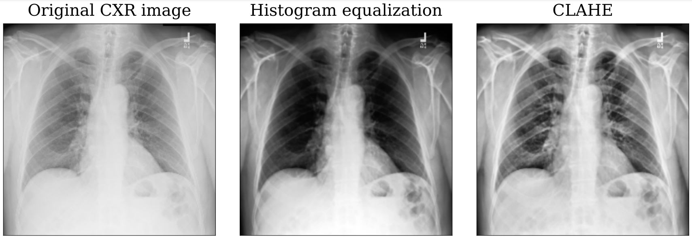

# Detection of COVID-19 in X-Ray images using Neural Networks
### _Author: Dominik Chodounský_

---

The set of files and IPython notebooks published in this repository served as the basis for the experimental part of my Bachelor's thesis on the topic of Detection of COVID-19 in X-Ray images using Neural Networks at the Faculty of Information Technology under the supervision of Ing. Jakub Žitný.

The goal was to explore the possibilities of performing binary detection of COVID-19 from chest X-ray images using state-of-the-art image preprocessing and deep learning techniques.

If you find this research useful, you can cite it using:
```
@thesis{chodounsky_covid_detection,
    title={Detection of COVID-19 in X-ray images using Neural Networks},
    author={Dominik Chodounský},
    school= {Czech Technical University in Prague, Faculty of Information Technology},
    year={2021},
    type={Bachelor's Thesis},
}
```

---

### Directory structure
- __/src__ - directory containing all source files and IPython notebooks used in experimentation
- __/environment.yml__ - environment specifications for setting up a virtual Python environment to run the provided scripts and notebooks

---


### Source files
The __/src__ directory contains the following:
- __model_architectures__ - directory containing Python files with definitions of CNN models used in our experiments and also a file with our implementation of the DCGAN along with helper functions used during its training and evaluation
- __preprocessing__ - directory containing files with function definitions of our image preprocessing techinques, of preprocessing techniques provided by COVID-Net authors for their models, their provided notebooks for setting up the RICORD dataset and the complete COVIDx dataset for binary detection, and finally, our script for turning the original COVIDx dataset into one fit for our training pipeline 
(files _covid_net_preprocessing.py_, _create_COVIDx_binary.ipynb_, _create_ricord_dataset.ipynb_ are not our work, we have simply adapted provided files by the COVID-Net project and the link to the originals are in the individual files)
- __utils__ - contains function definitions of various utility and helper functions that are used during experimentation
- __*notebooks*__ - the majority of our work is summarized in provided notebooks (ipynb files) which provide interactive templates for performing standard training, cross-validation, hyperparameter optimization, evaluation, data exploration, etc... (description and documentation of each notebook is provided directly inside)


---

### Requirements
We recommend running all of the provided files within a virtual Python 3.8 environment managed by Conda (https://docs.conda.io/en/latest/). We have provided a file (environment.yml) with the specifications of all packages needed to run the scripts and IPython notebooks that are provided in the __/src__ folder.

To set up the environment with Conda, run the following command:
```
conda env create --name <ENV_NAME> --file=<PATH_TO_ENVIRONMENT_YML>
```

---

### Data setup
The data used during our experiments comes from the COVIDx dataset. The COVID-Net project (https://github.com/lindawangg/COVID-Net) are the authors behind the dataset. They have collected data from 6 publicly available data depositories and provided a training set and a test set for performing the detection of COVID-19. 

Most of our experiments were performed with the COVIDx8B version for binary detection of _negative_ and _positive_ class. Some tests exploring the generalization ability of the models used the COVIDx3 version, which we preprocessed to only contain binary classes.
The authors' steps to generate the COVIDx dataset are available here: https://github.com/lindawangg/COVID-Net/blob/master/docs/COVIDx.md .
We further preprocessed the dataset with our _/src/preprocessing/dataset_preprocessing.py_ script to organize the data by its classes, which enables its easier use with the Keras ImageDataGenerator class.

Link to the data used by us: https://drive.google.com/drive/folders/10PIW4rpVU8AETpNDZpyxPmJo00vOwJE7?usp=sharing .

Aside from zip files with the dataset versions, there is also a directory of image labels used by our preprocessing script and the weights of a DenseNet-121 CNN architecture pre-trained on ChestX-ray14 dataset downloaded from Kaggle (https://www.kaggle.com/theewok/chexnet-keras-weights).

---

### Convolutional Neural Networks
This section lists some of the most noteworthy and best-performing models trained during our experiments.

#### BaseNet
__BaseNet__ is our own prototype architecture. It was trained by 4-fold stratified cross-validation with an Adam optimizer.

Link to the best configuration of the model found during the training: https://drive.google.com/file/d/1iohhm9RebZpaSFWyVfKPdzic4uhjF91i/view?usp=sharing .

<p align="center">
	
	<br>
	<em>Architecture of our BaseNet prototype Convolutional Neural Network</em>
</p>

<p align="center">
	
	<br>
	<em>Confusion matrix of the BaseNet's predictions on the COVIDx8B test set</em>
</p>

#### Ensemble
We fine-tuned several well-established CNN architectures provided by the Keras framework and combined them with the BaseNet model to form an ensemble.

All of these architectures were pre-trained on other datasets, so we locked their convolutional base first 5 epochs of training and then continued to train the complete network for 10 more epochs, all with the Adam optimizer. 

Based on the ROC curve, we calculated an optimal classification threshold of 0.22 which was subsequently used to classify the ensemble's predictions.

Following are the links to each of the individual models:
- __DenseNet-121__ pre-trained on ChestX-ray14 data and fine-tuned on COVIDx8B: https://drive.google.com/file/d/16z2sZnduiHxvhhlo8wFY73Ps-O7ml1-o/view?usp=sharing
- __VGG16__ pre-trained on ImageNet data and fine-tuned on COVIDx8B: 
https://drive.google.com/file/d/1qL9BfD0yeLwAZBh7mMU3JfHU0JxSrpyf/view?usp=sharing
- __VGG19__ pre-trained on ImageNet data and fine-tuned on COVIDx8B: 
https://drive.google.com/file/d/10c8Th1Jjcs1RW9SCPEPNbIADY2kDSLbU/view?usp=sharing
- __ResNet-50__ pre-trained on ImageNet data and fine-tuned on COVIDx8B: 
https://drive.google.com/file/d/1_5weKnhkdAQeqalXoPzHttZmCpqxEbVK/view?usp=sharing
- __Xception__ pre-trained on ImageNet data and fine-tuned on COVIDx8B: 
https://drive.google.com/file/d/1-VhLiVaIxsD17p11humQ81SkrA1vvrj-/view?usp=sharing


<p align="center">
	
	<br>
	<em>Confusion matrix of the Ensemble's predictions on the COVIDx8B test set</em>
</p>

### Comparison of results

| Model architecture |  Train accuracy | Test accuracy | COVID-19 Sensitivity | COVID-19 Specificity | AUC | PPV |
|-------|-------|-------|-------|-------|-------|-------|
|BaseNet|0.9745|0.9550|0.93|0.98|0.987|0.9789|
|VGG16|0.9882|0.9750|0.95|__1.0__|0.998|__1.0__|
|VGG19|0.9865|0.9625|0.925|__1.0__|0.998|__1.0__|
|ResNet-50|0.9908|0.9575|0.92|0.995|0.997|0.9946|
|DenseNet-121|__0.9996__|0.9650|0.935|0.995|0.997|0.9947|
|Xception|0.9935|0.9550|0.91|__1.0__|__1.0__|__1.0__|
|Ensemble|0.9887|__0.9925__|__0.9850__|__1.0__|0.997|__1.0__|

### Explored image preprocessing techniques

Part of our experiments was dedicated to testing various preprocessing techniques of the chest X-ray images:
- Min-max normalization to transform the pixel intensities to range from 0 to 1 (no visual difference, but it improves the models' convergence)
- Histogram equalization to increase global contrast
- Contrast Limited Adaptive Histogram Equalization (CLAHE) to increase local contrast
- Segmentation of a high-intensity diaphragm region in the images, which may interfere with feature extraction and classification (original algorithm proposed by https://www.sciencedirect.com/science/article/pii/S138650562030959X?casa_token=FUOYfeuGpLIAAAAA:_prapbOvegf0O4JcvecJl_ppRhlC-ZEhp_JnETuy1q1DM2BYUQuscFi9lgqVJIMqW6NZdhrfFAk)
	- one version approximates the found contour with a polygon
	- second version encloses the found contour with a convex hull


<p align="center">
	
	<br>
	<em>Effect of applying histogram equalization and CLAHE on a chest X-ray image</em>
</p>

<p align="center">
	
	<br>
	<em>Diaphragm segmentation with polygon approximation of the contour</em>
</p>

<p align="center">
	
	<br>
	<em>Diaphragm segmentation with convex hull enclosing of the contour</em>
</p>


### Deep Convolutional Generative Adversarial Network
In order to explore the possibility of performing class balancing by generating the underrepresented class synthetically, we implemented a simple DCGAN architecture.

The first version which generates 256 x 256 pixel imaging does not have great quality, but the smaller 128 x 128 pixel configuration produces more hopeful results.

<p align="center">
	
	<br>
	<em>Synthetic 256 x 256 pixel chest X-ray images generated by our implementation of the DCGAN architecture</em>
</p>

<p align="center">
	
	<br>
	<em>Synthetic 128 x 128 pixel chest X-ray images generated by our implementation of the DCGAN architecture</em>
</p>
